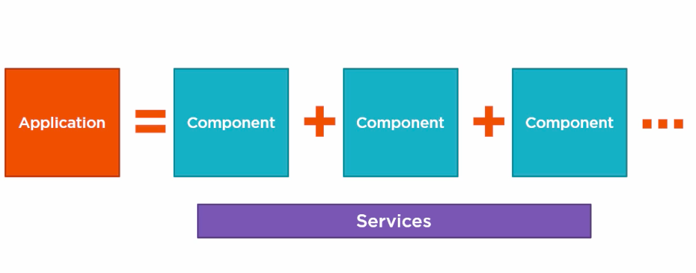
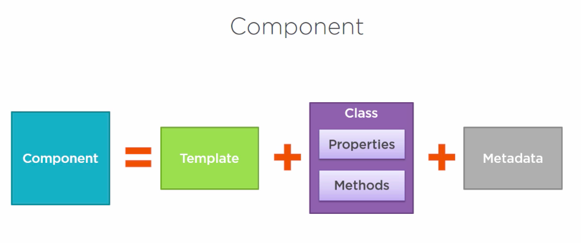
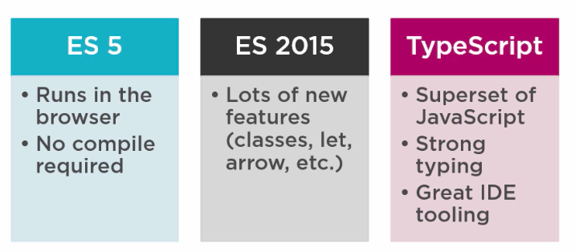
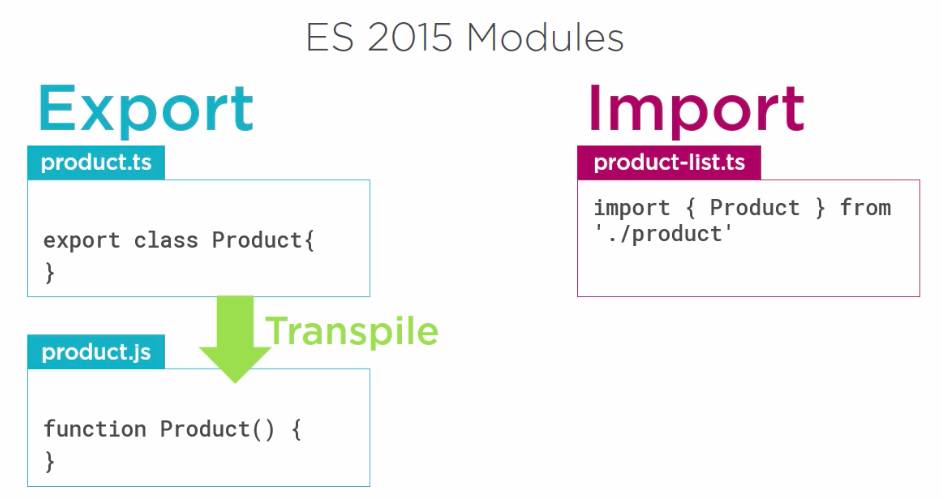
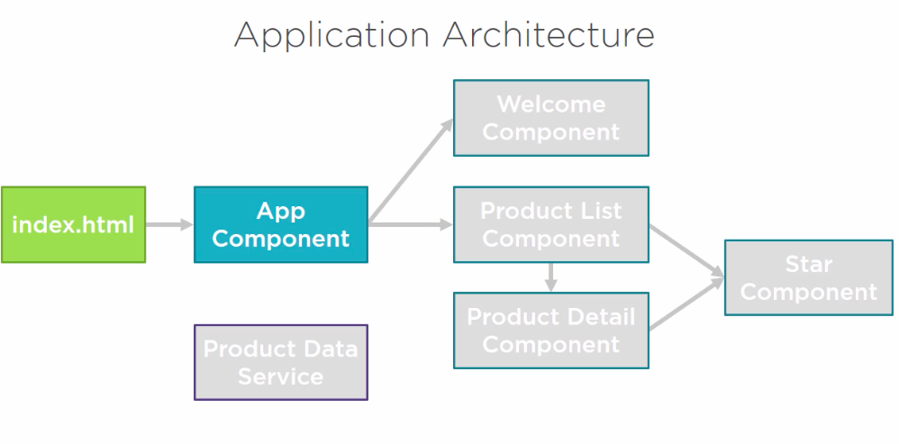
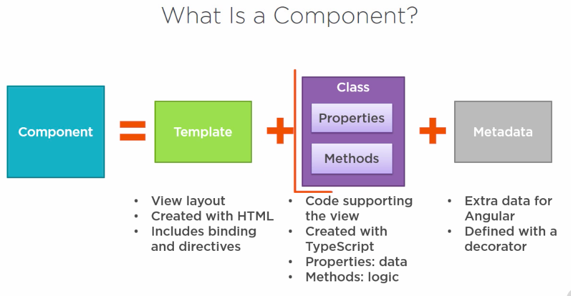
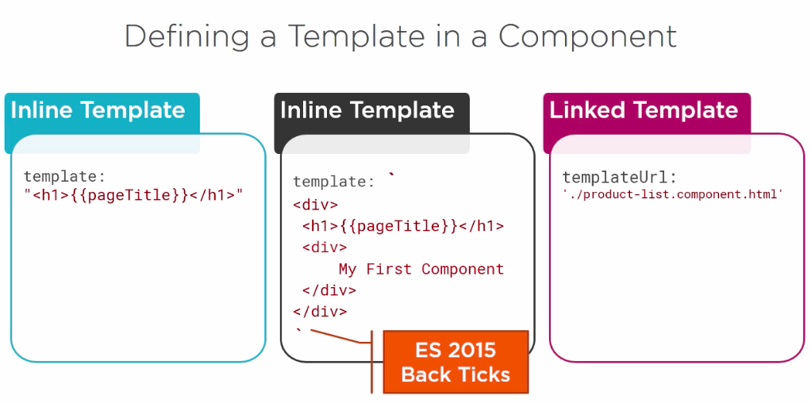
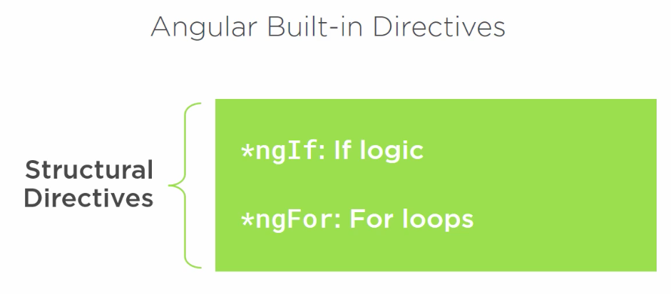
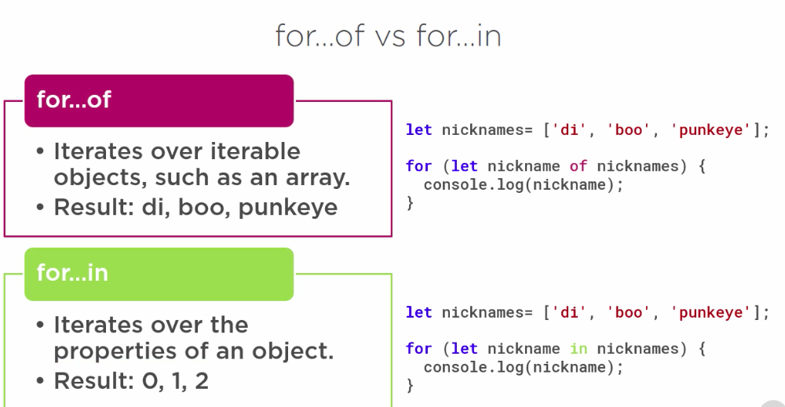
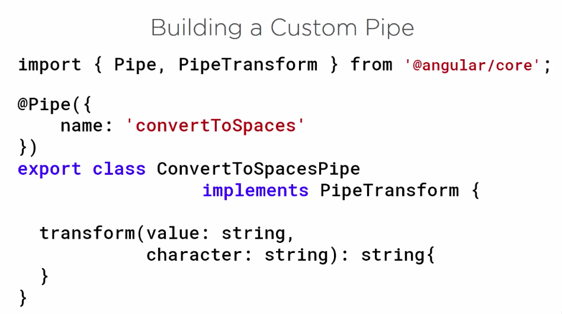

# ABC Product Management: AngularJS

## Why Angular
- Expressive HTML
- Powerful Data binding
- Modular by design
- Built-in Backend Integration

### Anatomy of Angular


- Component


Selecting a Language
--------------------
There are many languages to choose from. i.e.

The Java Script Language Specification officially called - ECMAScript(ES)
- The current version of ECMAScript is ES-5 and ES-2015(formerly known as ES-6)
- ES-2015 must be transpiled; means ES-2015 must be converted to ES5 syntax by a tool before browser process it.
- TypeScript (Super set of Java Script and Strong typing)


### What is TypeScript
- TypeScript is a open source Language
- Super set of JavaScript.
- Transpiles to plain JavaScript.
- Strongly typed.

TypeScript playground on [live coding](http://www.typescriptlang.org/play/).

### What is NPM(Node Package Manager)
- npm is a command line utility
- The package manager for JavaScript.
- Using we can install libraries, packages and applications and their dependencies.
- We can download npm from the following link. [Download NPM](https://nodejs.org/en/download/)

### Boilerplate code for Angular Application using CLI

### Modules


## Components
What is a component?
Application Architecture




### Decorator
- A function that adds `metadata` to a class, its members, or its method argument.
- Prefixed with @
- Angular provides built-in decorators.
- **@Component()**

```TypeScript
import { Component } from '@angular/core';

@Component({
  selector: 'pm-root',
  templateUrl: './app.component.html',
  styleUrls: ['./app.component.css']
})
export class AppComponent {
  title = 'ABC Product Management';
}
```

Defining Template
------------------


Styling Framework: http://getbootstrap.com/
Nice Font: https://fontawesome.com/

To install bootstrap and font-awesome use the following command
```console
npm install bootstrap font-awesome
```
To make it available in our component, we need to import in our styles.css


Angular Directives
------------------


For of VS For in
----------------
- For in : Iterating over the index
- For of : Iterating over the values


Life Cycle
----------
- OnInit: Perform component initialization, retrieve data.
- OnChanges: Perform action after change to input properties.
- OnDestroy: Perform cleanup

Building a custom Pipe
----------------------

